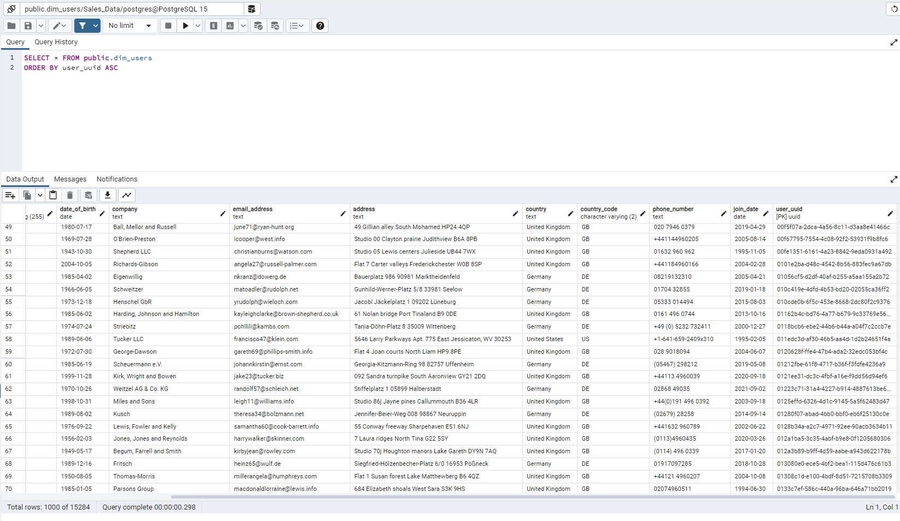
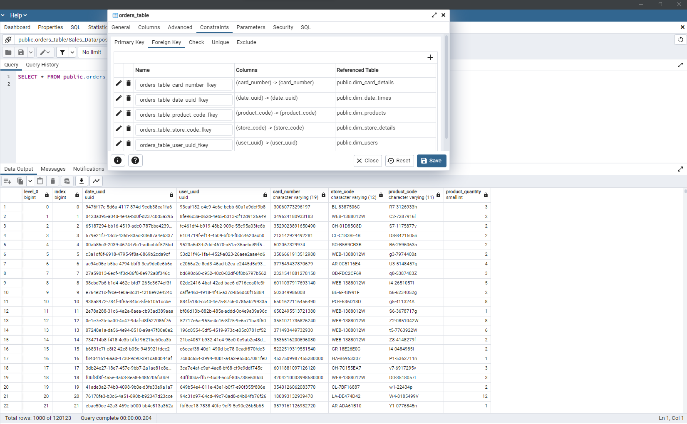

# AI-Core-Multinational-Retail-Data-Centralisation-Project

## Explanation of the project

You work for a multinational company that sells various goods across the globe. Currently, their sales data is spread across many different data sources making it not easily accessible or analysable by current members of the team. In an effort to become more data-driven, your organisation would like to make its sales data accessible from one centralised location. Your first goal will be to produce a system that stores the current company data in a database so that it's accessed from one centralised location and acts as a single source of truth for sales data. You will then query the database to get up-to-date metrics for the business.

## Milestone 1

The GitHub repo was set up by creating a local folder and then using the git clone method to clone the remote repo into a local folder

## Milestone 2

### Task 1

A new database was created on PgAdmin4 named sales_data, this was used to store the dataframes locally on a database that can be queried using PostgreSQL.

### Task 2

Created three new python files: 

* data_extraction.py - A file used to extract data from different sources using methods within a class called DataExtractor

* database_utils.py - This file was used for connecting to Databases and to upload the cleaned pandas dataframes using a class called DatabaseConnector

* data_cleaning.py - Contains a class called DataCleaning with methods to clean data from each of the data sources

### Task 3

#### Step 1

Some of the stores data was stored in an AWS RDS, therefore a YAML folder was created to store the database credentials:

```yaml

RDS_HOST: data-handling-project-readonly.cq2e8zno855e.eu-west-1.rds.amazonaws.com
RDS_PASSWORD: AiCore2022
RDS_USER: aicore_admin
RDS_DATABASE: postgres
RDS_PORT: 5432

```
Within the DatabaseConnector class, the following method was used to read the YAML file (PyYAML was installed into a conda environment):

```python
def read_db_creds(self):

    with open('db_creds.yaml') as f:
        database = yaml.safe_load(f)

return database
```

A method init_db_engine within the DatabaseConnector class was created, which will read the credentials from the return of read_db_creds and initialise and return an sqlalchemy database engine:

```python
def init_db_engine(self):

    connector = f"postgresql://{self.db_creds['RDS_USER']}:{self.db_creds['RDS_PASSWORD']}@{self.db_creds['RDS_HOST']}:{self.db_creds['RDS_PORT']}/{self.db_creds['RDS_DATABASE']}"
    engine = create_engine(connector)
    return engine
```

#### Step 2

All the tables in the RDS database were listed using the list_db_tables method in the DatabaseConnector class.
Then the data was read from tables using the method read_rds_table which was located in the DataExtractor class(data_extraction.py), the arguments given to it were the engine and table_name.

```python
def read_rds_table(self, engine, table):

    df = pd.read_sql_table(table, engine)
    return df
```
The user data (dim_users) table was cleaned using the clean_user_data method in the DataCleaning class(data_cleaning.py)
```python
@staticmethod
def clean_the_user_data(table):
    
    cleaned_users_df = table
    # perform cleaning operations on the dataframe here
    # cleaned_users_df.info()
    cleaned_users_df['country_code'] = cleaned_users_df['country_code'].astype('category')
    # cleaned_users_df.info()
    
    cleaned_users_df['date_of_birth'] = pd.to_datetime(cleaned_users_df['date_of_birth'], infer_datetime_format=True, errors='coerce')
    cleaned_users_df['join_date'] = pd.to_datetime(cleaned_users_df['join_date'], infer_datetime_format=True, errors='coerce')
    cleaned_users_df.dropna(how='all', inplace=True)

    # create a regex pattern to match rows with random letters and numbers
    pattern = r'^[a-zA-Z0-9]*$'

    # create a boolean mask for missing or random values
    mask = (cleaned_users_df['date_of_birth'].isna()) | (cleaned_users_df['date_of_birth'].astype(str).str.contains(pattern))

    # drop the rows with missing or random values
    cleaned_users_df = cleaned_users_df[~mask]

    pd.set_option('display.max_columns', None)
    
    return cleaned_users_df
```

#### Step 3

A method was created in order to upload this user data to the sales_data database. This method was called upload_to_db and it was within the DatabaseConnector class of the "database_utils.py file". The table was named dim_users:

```python
def upload_to_db(self, df, table_name):

    
    host = "localhost",
    user = "postgres",
    dbname = "Sales_Data",
    password = "",
    port = 5432

    with open('db_local_creds.yaml') as f:
        creds = yaml.safe_load(f)

    engine = create_engine(f"{'postgresql'}+{'psycopg2'}://{creds['user']}:{creds['password']}@{creds['host']}:{creds['port']}/{creds['dbname']}")
    engine.connect()
    df.to_sql(table_name, engine, if_exists='replace')
```

### Task 4

Tabula was used to extract the user card details information, this is because it was stored in a PDF document within an AWS S3 bucket. Within the DataExtractor class the method retrieve_pdf_data was created to get this information:

```python
@staticmethod
def retrieve_pdf_data(pdf_path):
    
    df = tabula.read_pdf(pdf_path, multiple_tables=False, pages='all', stream=True)
    users_card_details_df = df[0]
    return users_card_details_df
```
The data was then cleaned in the clean_card_data method within the DataCleaning class, then it was uploaded to the RDS with the name dim_card_details.

### Task 5

The store details data was extracted using an API. To find out how many stores were in the dataframe, the method list_number_of_stores was created in the DataExtractor class:

```python
@staticmethod
def list_number_of_stores(endpoint, headers):

    response = requests.get(endpoint, headers=headers)
    return int(response.text[37:40])
```
There were 451 stores in the dataframe, therefore when iterating through them to gather them the range was set to start at 0 and end at 451. This method was called retrieve_stores_data in the DataExtractor class:

```python
@staticmethod
def retrieve_stores_data(endpoint, headers):

    # Create an empty list to hold the store data
    store_data = []

    # Loop over all possible store numbers
    for store_number in range(0, 451):
        
        # Construct the store endpoint URL using the current store number
        url = endpoint.format(store_number=store_number)

        # Make a request to the store endpoint
        response = requests.get(url, headers=headers)

        # Extract the store data from the response JSON
        store_json = response.json()

        # Append the store data to the store_data list
        store_data.append(store_json)

    # Convert the store data to a pandas DataFrame
    store_data_df = pd.DataFrame(store_data)

    # Return the DataFrame
    return store_data_df
```

After extracting the store data and turning it into a pandas dataframe, it was cleaned and uploaded to the sales_data database. The data was cleaned and uplaoded by using clean_store_data method in DataCleaning and upload_to_db in DatabaseConnector. The name given to the uploaded dataframe was dim_store_details.

### Task 6

#### Step 1

boto3 was used to extract the products details as they were stored in an s3 bucket on AWS. I had to be within the AWS CLI in order to extract the data, as I needed to be granted access. The boto3 extraction was done in a method called extract_from_s3 in the DataExtractor class:

```python
@staticmethod
def extract_from_s3(s3_address):
    """
    Extracts the data from the specified S3 address and returns a pandas DataFrame.
    
    Args:
    s3_address (str): The S3 bucket address where the products data is stored.
    
    Returns:
    pandas DataFrame: The extracted products data.
    """
    # Set up the S3 client
    s3 = boto3.client('s3')

    # Retrieve the object
    s3_bucket, s3_key = s3_address.split('/', 3)[-2:]
    obj = s3.get_object(Bucket=s3_bucket, Key=s3_key)

    # Read the object data into a pandas DataFrame

    products_df = pd.read_csv(obj['Body'], index_col=0)

    return products_df
```

#### Step 2 

This data needed a new column to categorise the weights of different products, so within the DataCleaning class the method convert_product_weights was created:

```python
@staticmethod
def convert_product_weights(table):

    converted_product_weights = table

    converted_product_weights.dropna(how='all', inplace=True)
    converted_product_weights['date_added'] = pd.to_datetime(converted_product_weights['date_added'], infer_datetime_format=True, errors='coerce')

    # create a regex pattern to match rows with random letters and numbers
    pattern = r'^[a-zA-Z0-9]*$'

    # create a boolean mask for missing or random values
    mask = (converted_product_weights['date_added'].isna()) | (converted_product_weights['date_added'].astype(str).str.contains(pattern))

    # drop the rows with missing or random values
    converted_product_weights = converted_product_weights[~mask]

    new_units = []
    for w in converted_product_weights['weight']:
        w = str(w).strip('.')
        w = str(w).strip('l')
        w = str(w).strip()  # remove any leading/trailing spaces
        if w.endswith('kg'):
            new_units.append(float(w[:-2]))
        elif 'x' in w:
            num, unit = w.split('x')
            new_units.append(float(num)*float(unit.rstrip('g'))/1000)
        elif w.endswith('g'):
            new_units.append(float(w[:-1])/1000)
        elif w.endswith('oz'):
            new_units.append(float(w[:-2])*0.0283)
        elif w.endswith('m'):
            new_units.append(float(w[:-1])/1000)
        else:
            new_units.append(float(w))
    converted_product_weights['weight_class'] = [ 'Light' if x <= 2
                            else 'Mid_Sized' if x >2 and x<= 40 
                            else 'Heavy' if x>40 and x<=140
                            else 'Truck_Required'
                    for x in new_units]

    converted_product_weights.loc[:, 'weight'] = new_units
    return converted_product_weights
```

This code shows the cleaning of the original columns, but also the addition of a new column which is used to categorise products into four different weight categories:

* Light
* Mid_Sized
* Heavy
* Truck_Required


After this the table was uploaded to the database under the name dim_products

### Task 7

The orders table from the original AWS RDS tables was extracted using list_db_tables and read_rds_table methods. The method clean_orders_data in the DataCleaning class was created in order to remove some useless columns:
```python
@staticmethod
def clean_orders_data(table):

    cleaned_orders_df = table
    cleaned_orders_df.drop(['level_0', 'first_name', 'last_name', '1'], axis=1, inplace=True)
    
    return cleaned_orders_df
```

This table acted as the centre of the star based schema as it was the table which contained columns that related to all the other tables. It is considered the source of truth table and it was created to be used as the main table of the schema when querying it. It was uploaded to the database under the name orders_table. 

### Task 8

The final task was to extract a json from an s3 bucket using requests.get. The data being extracted was the details of whne each sale happened. The dataframe was cleaned and uploaded to the database under the name dim_date_times.

### Note for coding environment

All extractions, cleaning and uploads were done in the data_extraction.py, this was possible as the engine was placed into the initialiser of the DatabaseConnector class:

```python

from database_utils import DatabaseConnector
from data_cleaning import DataCleaning

db_connector = DatabaseConnector()
db_extractor = DataExtractor()

users_df = db_extractor.read_rds_table(table='legacy_users', engine = db_connector.engine)
cleaned_users_df = DataCleaning.clean_the_user_data(users_df)
db_connector.upload_to_db(cleaned_users_df, 'dim_users')


card_details_df = db_extractor.retrieve_pdf_data("https://data-handling-public.s3.eu-west-1.amazonaws.com/card_details.pdf")
cleaned_users_card_details_df = DataCleaning.clean_card_data(card_details_df)
db_connector.upload_to_db(cleaned_users_card_details_df, 'dim_card_details')


headers={'x-api-key': 'yFBQbwXe9J3sd6zWVAMrK6lcxxr0q1lr2PT6DDMX'}
stores_data = "https://aqj7u5id95.execute-api.eu-west-1.amazonaws.com/prod/store_details/{store_number}"
store_data = retrieve_stores_data(stores_data, headers)
cleaned_store_data = DataCleaning.clean_store_data(store_data)
db_connector.upload_to_db(cleaned_store_data, 'dim_store_details')


products_df = db_extractor.extract_from_s3("s3://data-handling-public/products.csv")
converted_weights = DataCleaning.convert_product_weights(products_df)
db_connector.upload_to_db(converted_weights, 'dim_products')


orders_df = db_extractor.read_rds_table(table='orders_table', engine=db_connector.engine)
clean_orders_table = DataCleaning.clean_orders_data(orders_df)
db_connector.upload_to_db(clean_orders_table, 'orders_table')

url = 'https://data-handling-public.s3.eu-west-1.amazonaws.com/date_details.json'
datetime_df = db_extractor.extract_json_from_s3(url)
cleaned_datetime = DataCleaning.clean_datetime_df(datetime_df)
db_connector.upload_to_db(cleaned_datetime, 'dim_date_times')
```

## Milestone 3

All of the tables given the correct column castings such as: VARCHAR, FLOAT, UUID, DATE, etc...
Then certain columns were given primary keys and foreign keys:



### Examples of column casting

alter table orders_table
	alter column date_uuid set data type UUID USING date_uuid::uuid;
	
alter table orders_table
	alter column user_uuid set data type UUID USING user_uuid::uuid;

alter table dim_users
	alter column first_name set data type varchar(255);
	
alter table dim_users
	alter column last_name set data type varchar(255);
	
alter table dim_users
	alter column date_of_birth set data type date;

alter table dim_users
	alter column country_code set data type varchar(2);
	
alter table dim_users
	alter column user_uuid set data type UUID USING user_uuid::uuid; 
	
alter table dim_users
	alter column join_date set data type DATE;

### The centre of the star based schema

The centre of the star based schema was the orders_table, which had 5 foreign keys which corresponded to the other tables in the database:



## Milestone 4

The last part of this project was to query the database using PostgreSQL

### Examples of queries

* Task 1: How many stores does the business have and in which countries?

```sql
SELECT country_code, COUNT(*) AS total_no_stores
FROM dim_store_details
GROUP BY country_code;
```

* Task 2: Which locations currently have the most stores?

```sql
SELECT locality, COUNT(*) AS total_no_stores
FROM dim_store_details
GROUP BY locality;
```

* Task 3: Which months produce the average highest cost of sales typically?

```sql
SELECT 
       SUM(pr.product_price * ord.product_quantity) AS sales, dt.month  
FROM dim_products AS pr
JOIN orders_table AS ord ON pr.product_code = ord.product_code
JOIN dim_date_times AS dt ON dt.date_uuid = ord.date_uuid
  GROUP BY dt.month
  ORDER BY sales DESC
  LIMIT 6
```

* Task 4: How many sales are coming from online?

```sql
SELECT
  COUNT(*) AS number_of_sales,
  SUM(product_quantity) AS product_quantity_count,
  CASE 
	WHEN store_code = 'WEB-1388012W' THEN 'Web' 
	ELSE 'Offline'
  END AS location  
FROM orders_table 
GROUP BY location
```

* Task 5: What percentage of sales come through each type of store?

```sql
SELECT 
  store_type,
  ROUND(SUM(product_quantity * product_price)::numeric, 2) AS total_sales,
  ROUND((SUM(product_quantity * product_price) / 
     (SELECT SUM(product_quantity * product_price) FROM dim_store_details AS st
      JOIN orders_table AS ord ON st.store_code = ord.store_code
      JOIN dim_products AS pr ON pr.product_code = ord.product_code))::numeric * 100, 2) 
    AS "percentage_total(%)"
FROM dim_store_details AS st
JOIN orders_table AS ord ON st.store_code = ord.store_code
JOIN dim_products AS pr ON pr.product_code = ord.product_code
GROUP BY store_type
ORDER BY total_sales DESC;
```

* Task 6: Which month in each year produced the highest cost of sales?

```sql
SELECT 
ROUND(SUM(product_quantity * product_price)::numeric, 2) AS total_sales,
dt.year, 
dt.month
FROM dim_date_times AS dt
JOIN orders_table AS ord ON dt.date_uuid = ord.date_uuid
JOIN dim_products AS pr ON pr.product_code = ord.product_code
GROUP BY dt.month, dt.year
ORDER BY total_sales DESC
LIMIT 10;
```

* Task 7: What is our staff headcount?

```sql
SELECT SUM(staff_numbers) AS total_staff_numbers,
country_code
FROM dim_store_details
GROUP BY country_code
ORDER BY total_staff_numbers DESC
```

* Task 8: Which German store type is selling the most

```sql
SELECT SUM(product_quantity * product_price) AS total_sales,
store_type,
country_code
FROM dim_store_details AS st
JOIN orders_table AS ord ON ord.store_code = st.store_code
JOIN dim_products AS pr ON pr.product_code = ord.product_code
WHERE country_code = 'DE'
GROUP BY store_type, country_code
ORDER BY total_sales ASC; 
```